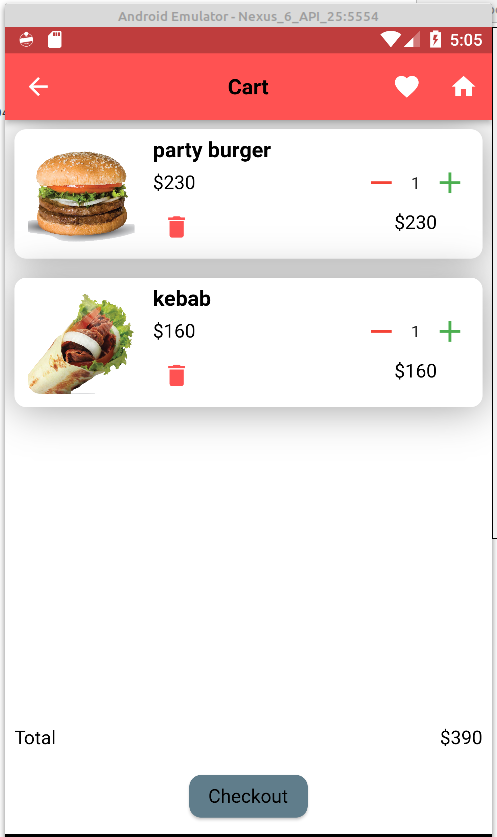

# **Project Name: The Food Freaks**
> <cite>Made By Flutter Intern Team - DivineIt Limited</cite>
- Touhidur Rahman
- Azad Hossain
- Kanij Koli

## For help
- [Cookbook: Useful Flutter samples](https://flutter.dev/docs/cookbook)
- [online documentation](https://flutter.dev/docs), which offers tutorials,
samples, gui 

**Table of Content**

1. [Summary](#summary)
1. [Basic Project Setup](#basic-project-setup)
1. [Sign in Page](#sign-in-page)
1. [Sign Up Page](#sign-up-page)
1. [Home Page](#home-page)
1. [Menu Button](#menu-button)
1. [Popular Page](#popular-page)
1. [Favorite Page](#favorite-page)
1. [Restaurant Page](#restaurant-page)
1. [Product Details Page](#product-details-page)
1. [Cart Page](#Cart-page)
1. [Payment Page](#payment-page)

## Summary:

We implemented a Food ordering Android/Ios App using Flutter Framework and Backend using Python3, Django Rest Framework. This app has a Token-based authentication system using Username and Password. First users need to create an account to use the application. After successfully going through authentication users can see the Application UI in the app. 

Here users can see all food items and also popular food items of different kinds of restaurants. Users cannot order food from more than one restaurant at one time but can order more than one food item from the same restaurant at the same time. Users can see food details such as the image of food, it's rating and description. Users can cart them for order or place food items on their favorites for watching later or next time ordering. Users can change the quantity of items inside the cart, can add/remove items from the cart. The application will notify users of changes if needed. When the user confirms the cart, the user can complete the order going through the payment process.

## Basic Project Setup
1. Clone this GitHub repository.
1. [Create virtual Environment Backend:](#create-virtual-environment-backend)
1. [Flutter Project Setup:](#flutter-project-setup)

## Create virtual Environment Backend 
You need to make a virtual environment with the requirements.txt file but if you don't have python in your system please install it.

steps:
- **Follow the command bellow**
- pip install virtualenv
- virtualenv venv  (to create your new environment called 'venv' here)
- source venv/bin/activate 
- pip install -r requirements.txt (to install the requirements in the current environment
- python3 manage.py migrate
- python3 manage.py createsuperuser (create a super user)
- python3 manage.py runserver

## Flutter Project Setup
Run the following command from project folder in terminal  
steps:
 - flutter packages get

## **Application Preview:**

## Sign In Page

Users can log in using their email/username and password, but if they do not have an account, they need to Register first.

## Sign Up Page 

To get started, users need to register. 

## Home Page

The user can see the application's home page after logging in. Here the user is shown a side-menu, search bar where they can type in the name or keyword of a food item and press the search button. On this page, users can view the food slider, the popular food items in restaurants by sliding, and the restaurants themselves.

## Menu Button 

Users can access several options when they click on the menu button, such as User Profile, Settings, and Logout. 

## Popular Page

Users will find here the most popular food items. 

## Favorite Page

The user can favorite items they like the most in order to watch them later or order them again at a later time.  

## Restaurant Page

Users can find any type of restaurant near them and order products directly from that restaurant.  

## Product Details Page

Users can view food details including its image, rating, and description.

## Cart Page

After adding food to the cart users can see that item in the cart and they can order. Users can change the quantity of items. It is not possible to order food from more than one restaurant at a time, but you can order multiple items from the same restaurant.

## Payment Page

The user pays for the order after clicking checkout.

<!-- #we will do -- 
1. Google/Email (signup / login) authentications
2. OTP mobile verification, (Optional)
3. Payment method (Bkash / Rocket)
4. Google Maps Integration,
5. Push Notifications
6. Chat, Tracking orders
7. Multi Roles and Permissions (Optional) -->

